# TeleTrack — Manuel d'utilisation et de maintenance

**TeleTrack** centralise la déclaration, le suivi et le traitement des incidents de téléphonie pour les 216 agences du réseau **Banque Populaire Rabat-Kénitra**, réparties en 14 succursales.

Développée dans le cadre d'un stage au Département Informatique (juillet–août 2026).

Ce document s'adresse au **Département Informatique**. Il a deux objectifs :

1. Expliquer **comment utiliser** l'application au quotidien (agences, admins, superadmin).
2. Expliquer **comment le projet est construit**, pour qu'un membre de l'équipe puisse installer le projet, comprendre le code, et le faire évoluer sans avoir à tout redécouvrir seul.

Il est écrit simplement, sans supposer de connaissances techniques poussées — chaque terme un peu technique est expliqué au moment où il apparaît.

> Ce fichier est mis à jour à chaque évolution importante de l'application — c'est la référence à jour du projet.

---

## Table des matières

1. [Présentation générale](#1-présentation-générale)
2. [Guide d&#39;utilisation — Espace agence](#2-guide-dutilisation--espace-agence)
3. [Guide d&#39;utilisation — Espace admin](#3-guide-dutilisation--espace-admin)
4. [Guide d&#39;utilisation — Fonctions superadmin](#4-guide-dutilisation--fonctions-superadmin)
5. [Guide technique — Installation](#5-guide-technique--installation)
6. [Guide technique — Architecture du projet](#6-guide-technique--architecture-du-projet)
7. [Guide technique — Base de données](#7-guide-technique--base-de-données)
8. [Guide technique — Concepts clés à connaître avant de modifier le code](#8-guide-technique--concepts-clés-à-connaître-avant-de-modifier-le-code)
9. [Guide technique — Liste des routes de l&#39;API](#9-guide-technique--liste-des-routes-de-lapi)
10. [Guide technique — Comment ajouter une fonctionnalité](#10-guide-technique--comment-ajouter-une-fonctionnalité)
11. [Variables d&#39;environnement](#11-variables-denvironnement)
12. [FAQ et dépannage](#12-faq-et-dépannage)
13. [Pour aller plus loin](#13-pour-aller-plus-loin)

---

## 1. Présentation générale

Avant TeleTrack, une agence signalait un problème téléphonique par appel, sans aucun suivi organisé. TeleTrack donne à chaque agence un lien dédié pour déclarer un incident, et donne au siège un tableau de bord centralisé pour le traiter et communiquer avec l'agence.

### Les trois types d'utilisateurs

| Qui            | Comment il accède                                                         | Ce qu'il peut faire                                                                     |
| -------------- | ------------------------------------------------------------------------- | --------------------------------------------------------------------------------------- |
| **Agence**     | Lien unique`.../agence/<code_agence>`, **sans compte, sans mot de passe** | Déclarer un incident, suivre ses tickets, discuter avec l'admin, marquer résolu/rouvrir |
| **Admin**      | Connexion par matricule + mot de passe                                    | Traiter les tickets, gérer les agences, tableau de bord                                 |
| **Superadmin** | Comme un admin, avec un rôle en plus                                      | Tout ce qu'un admin peut faire, + gérer les comptes admin                               |

L'agence n'a pas de compte volontairement : l'application ne traite aucune donnée confidentielle, et n'est accessible que depuis le réseau interne de la banque — un mot de passe n'aurait rien apporté de plus en sécurité, tout en compliquant l'usage pour des employés d'agence non techniques.

### Architecture en un coup d'œil

```text
Navigateur (React)  <-->  Serveur (Node.js / Express)  <-->  Base de données (MySQL)
```

- **Frontend** : React (via Vite), affiché dans le navigateur.
- **Backend** : Node.js/Express, reçoit les requêtes du frontend et interroge la base de données.
- **Base de données** : MySQL, gérée via phpMyAdmin.

Le code est organisé en **deux espaces séparés** : un espace **admin** (protégé, réservé au personnel du siège) et un espace **agence** (public, sans compte). Cette séparation existe aussi bien côté backend (dossiers `routes/admin/` et `routes/agence/`) que côté frontend (`pages/admin/` et `pages/agence/`) — voir [section 6](#6-guide-technique--architecture-du-projet).

---

## 2. Guide d'utilisation — Espace agence

### 2.1. Accéder à son espace

Chaque agence reçoit un lien unique de la forme :

```text
https://<adresse-du-serveur>/agence/<code_agence>
```

Il suffit d'ouvrir ce lien dans un navigateur — aucune connexion n'est demandée. Ce lien peut être mis en favori sur le poste de l'agence.

### 2.2. Page d'accueil

Affiche :

- L'identité de l'agence (nom, code, succursale).
- Un résumé chiffré : tickets ouverts, en cours de traitement, résolus.
- Les 3 tickets les plus récents, avec un **point rouge** sur ceux qui ont du nouveau (réponse de l'admin, ou ticket pris en charge) depuis la dernière visite.
- Deux boutons : **Déclarer un incident** et **Voir mes tickets**.

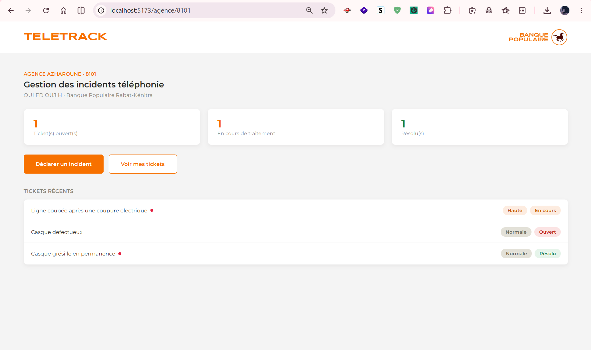

### 2.3. Déclarer un incident

Formulaire simple :

| Champ       | Détail                                                                                                                                                                                                         |
| ----------- | -------------------------------------------------------------------------------------------------------------------------------------------------------------------------------------------------------------- |
| Titre       | Résumé court du problème                                                                                                                                                                                       |
| Type        | **Interne** (matériel/configuration de l'installation téléphonique — le prestataire qui a fait l'installation intervient, sous garantie) ou **Externe** (réseau/opérateur — Itissalat Al Maghrib est contacté) |
| Priorité    | Normale, Haute ou Urgente                                                                                                                                                                                      |
| Description | Détail du problème (facultatif)                                                                                                                                                                                |

Après validation, l'agence est redirigée directement vers la page de suivi de son nouveau ticket.

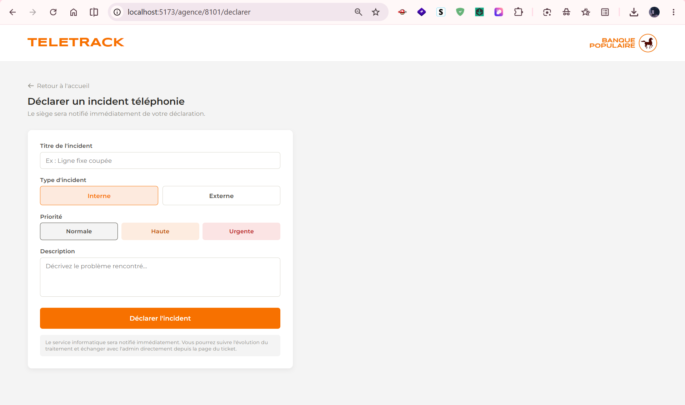

### 2.4. "Mes tickets" (liste)

Historique complet des tickets de l'agence, avec recherche par titre, filtres (état, type, priorité), et tri par date de déclaration. Un point rouge signale les tickets avec du nouveau.

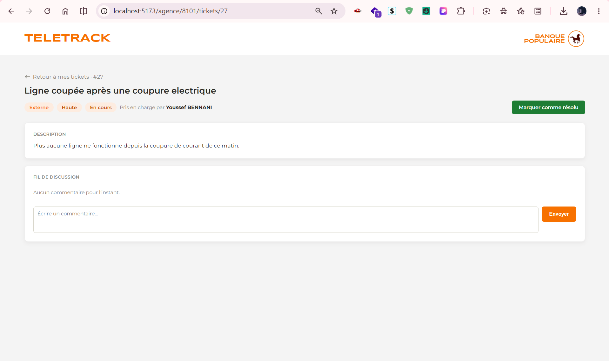

### 2.5. Détail d'un ticket

Affiche :

- Le titre, le type, la priorité, l'état.
- **Qui est en charge** ("Pris en charge par [Prénom Nom]"), si un admin s'en occupe.
- La description.
- Le **fil de discussion** : l'agence peut répondre à tout moment ; les messages de l'agence et de l'admin sont affichés différemment (bulles de chat) pour bien distinguer qui a écrit quoi.
- Un bouton **"Marquer comme résolu"**, ou **"Rouvrir ce ticket"** si le ticket est déjà résolu (par exemple si le problème revient).

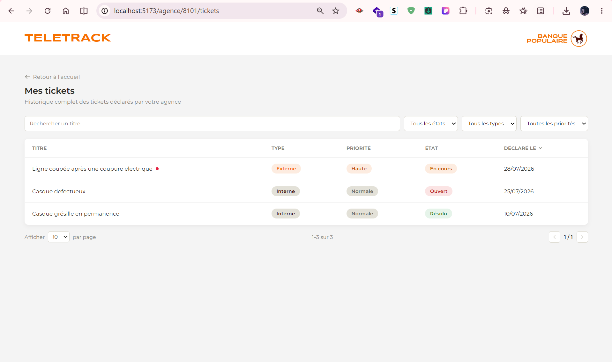

> Important : l'agence peut marquer un ticket résolu ou le rouvrir, mais ne peut jamais le remettre "en cours" elle-même — cet état signifie "un admin s'en occupe activement", c'est donc à l'admin de le faire.

### 2.6. Notifications côté agence

Un **point rouge** apparaît sur un ticket (liste et accueil) dès qu'un admin y répond ou qu'un admin est désormais assigné dessus, et disparaît dès que l'agence rouvre ce ticket. Aucun email n'est envoyé pour l'instant (voir [section 8.3](#83-notifications-et-le-petit-point-rouge)) — sauf pour l'assignation, une fois le SMTP configuré par le siège.

---

## 3. Guide d'utilisation — Espace admin

### 3.1. Connexion

Connexion par **matricule** + **mot de passe**, sur `/login`. À la création d'un compte (ou après une réinitialisation par un superadmin), l'admin reçoit un mot de passe temporaire et **doit le changer** dès sa première connexion.

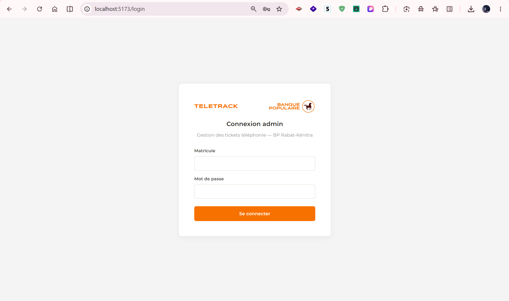

### 3.2. Tableau de bord

Deux groupes d'indicateurs, volontairement séparés :

- **Réseau** (concerne tout le réseau, pas un admin en particulier) : tickets ouverts non assignés, priorité urgente, temps moyen de résolution.
- **Vos tickets** (propre à l'admin connecté) : ses tickets en cours de traitement, ses tickets résolus ce mois.

En dessous : deux graphiques (répartition des incidents par type, par succursale), et un tableau des nouveaux tickets non encore traités.

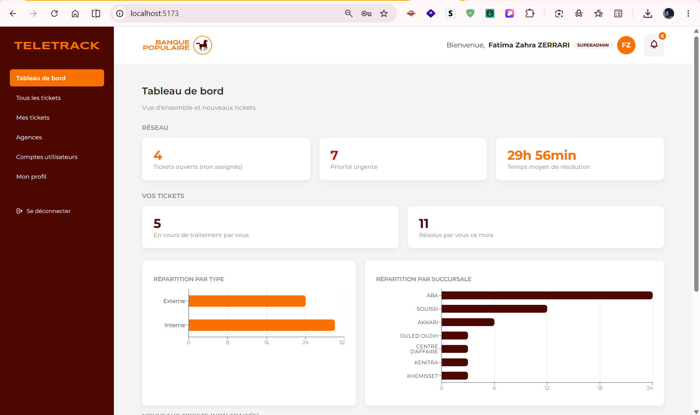
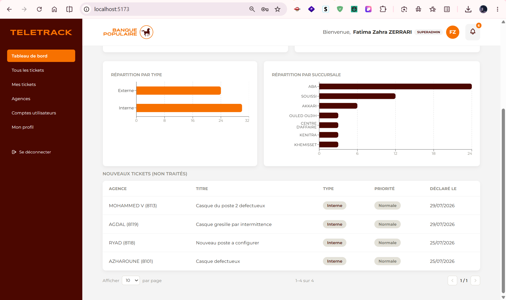

La cloche de notifications (en haut à droite) liste les nouveaux tickets non traités et les nouvelles réponses d'agence :

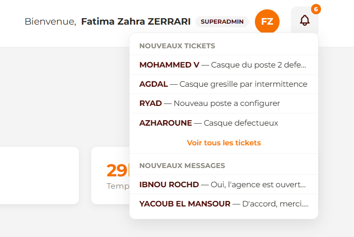

### 3.3. Liste des tickets

Deux vues :

- **Tous les tickets** : tous les incidents du réseau.
- **Mes tickets** : uniquement ceux assignés à l'admin connecté.

Les deux offrent recherche (agence, code, titre), filtres (état, type, priorité, date) et tri par date de déclaration. Un point rouge signale, ligne par ligne, les tickets avec du nouveau (nouveau message, ou assignation pas encore consultée).

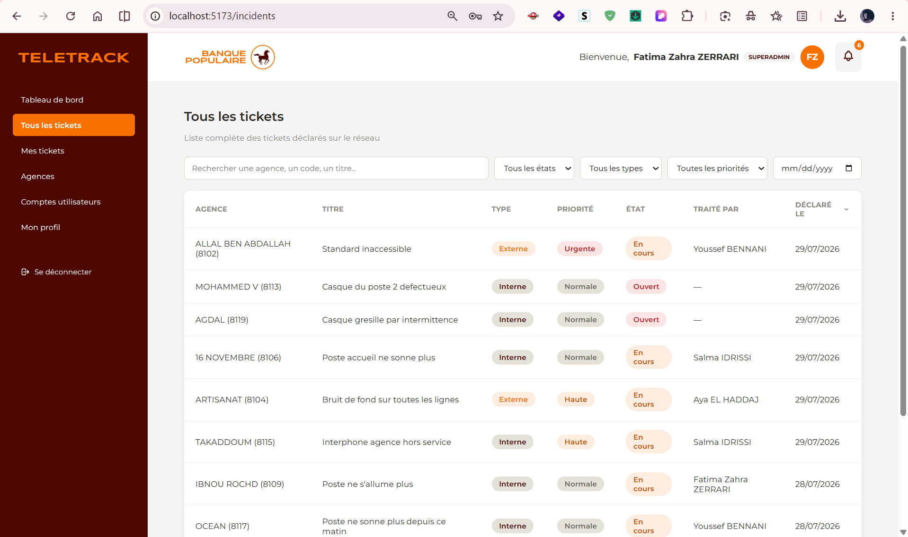
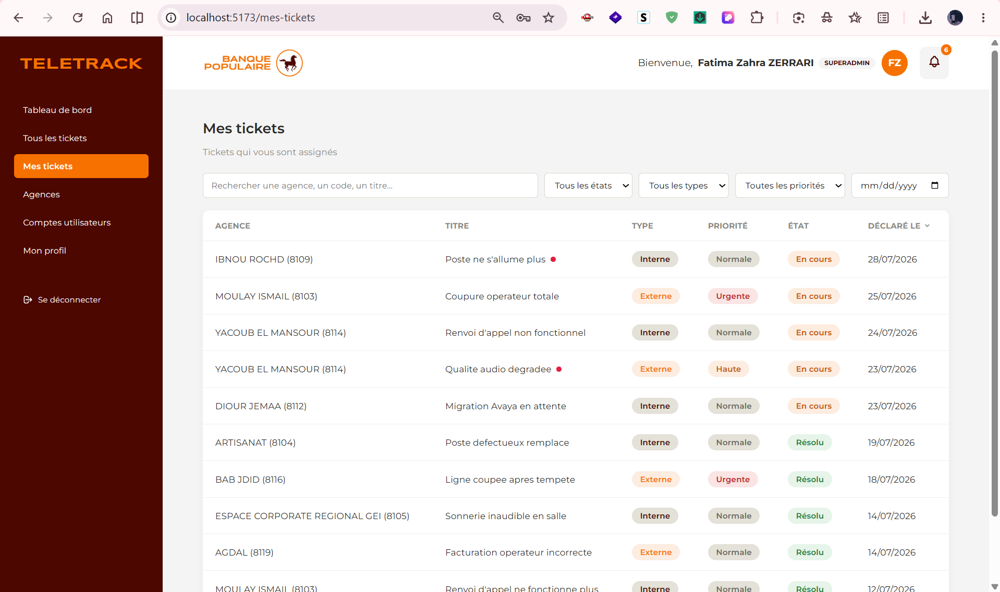

### 3.4. Détail d'un ticket

- Informations complètes de l'incident et informations de l'agence (modifiable : la plateforme téléphonique).
- Fil de discussion : un admin ne peut répondre **que s'il est l'admin assigné** à ce ticket — il doit d'abord se l'assigner.
- **S'assigner un ticket** libre ("S'assigner à moi").
- **Réassigner** un ticket : uniquement si c'est déjà son propre ticket (le superadmin peut réassigner n'importe quel ticket, pour rééquilibrer la charge de l'équipe).
- **Changer l'état** (ouvert / en cours / résolu) : réservé strictement à l'admin en charge du ticket, **sans aucune exception**, y compris pour le superadmin — marquer un ticket "résolu" est une affirmation technique que seule la personne qui traite réellement l'incident peut faire.

> Repasser un ticket à l'état "ouvert" vide automatiquement son admin assigné — le ticket redevient réellement disponible pour toute l'équipe.

Vue d'un ticket assigné à un **autre** admin — le fil de discussion et le changement d'état sont désactivés, avec une note explicative :

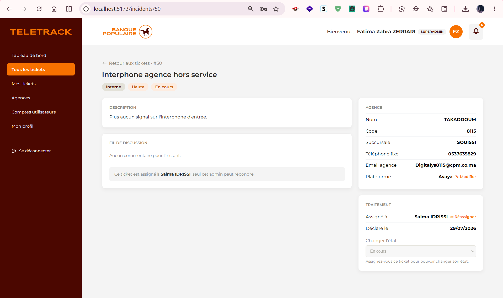

Vue de son **propre** ticket — le fil de discussion et le changement d'état sont actifs :

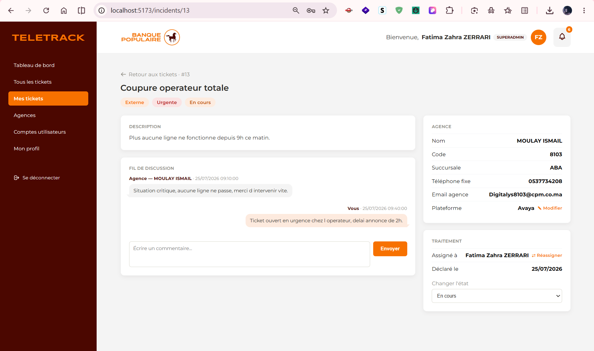

### 3.5. Gestion des agences

Liste des 216 agences, avec recherche, filtres (succursale, plateforme téléphonique), modification des informations d'une agence, export Excel (regroupé par succursale) et import/mise à jour en masse via un fichier Excel (la plateforme "Avaya" est appliquée par défaut si elle n'est pas précisée dans le fichier).

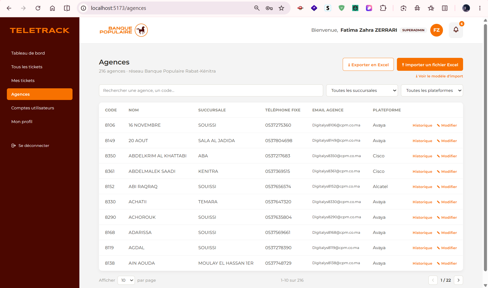

Un lien **"Historique"** sur chaque ligne mène à une page dédiée à l'agence : nombre total d'incidents, répartition par état (ouverts/en cours/résolus), temps moyen de résolution de cette agence à côté de la moyenne du réseau (deux chiffres simples, sans calcul à interpréter), et la liste complète de ses tickets (triable par date de déclaration). Utile pour repérer une agence qui a des problèmes récurrents, sans avoir à filtrer manuellement "Tous les tickets".

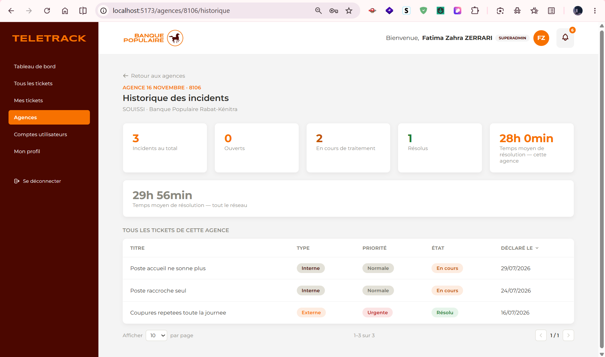

### 3.6. Mon profil

Chaque admin peut modifier son prénom/nom/email, changer volontairement son mot de passe, et ajouter une photo de profil (JPEG/PNG/WEBP, 2 Mo maximum).

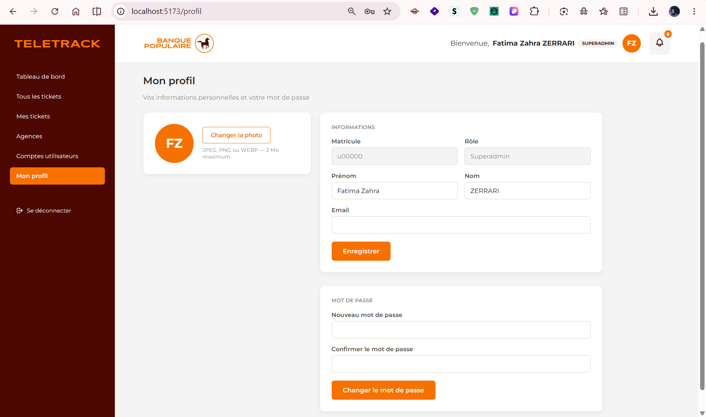

### 3.7. Notifications côté admin

- **La cloche** (en haut à droite) signale les nouveaux tickets non traités et les nouvelles réponses d'agence sur les tickets que l'admin traite.
- Un **point rouge** apparaît aussi ligne par ligne sur "Mes tickets" : nouveau message d'agence non lu, **ou** ticket qui vient d'être assigné/réassigné et jamais encore ouvert depuis.

---

## 4. Guide d'utilisation — Fonctions superadmin

En plus de tout ce qu'un admin peut faire, le superadmin voit un badge **"Superadmin"** dans l'en-tête, et a accès à la page **"Comptes admin"**.

### 4.1. Gestion des comptes admin

- **Créer un compte** : matricule, prénom, nom, email, rôle (admin ou superadmin). Un mot de passe temporaire est généré automatiquement et affiché **une seule fois** — à communiquer à la personne concernée.
- **Modifier un compte** : prénom, nom, email, rôle (impossible de changer son propre rôle, pour éviter de se bloquer soi-même par erreur).
- **Réinitialiser le mot de passe** d'un compte : génère un nouveau mot de passe temporaire, affiché une seule fois.
- **Activer / désactiver un compte** : un compte désactivé ne peut plus se connecter. **Il n'y a jamais de suppression définitive** d'un compte — pour garder l'historique de qui a traité quel ticket, même après le départ d'un employé.

> Garde-fous : impossible de désactiver son propre compte, ni le dernier superadmin actif restant.

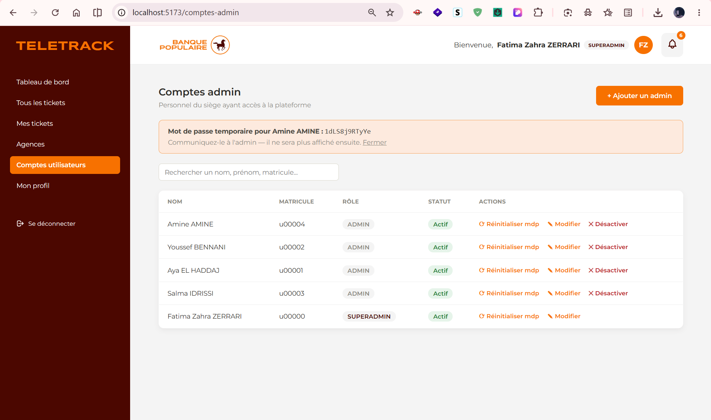

### 4.2. Pouvoirs particuliers du superadmin

- Peut réassigner **n'importe quel ticket** (pas seulement les siens), pour rééquilibrer la charge de travail entre admins.
- Ne peut **pas** changer l'état d'un ticket qui n'est pas le sien (même règle que pour un admin classique) — voir [3.4](#34-détail-dun-ticket) pour la raison.

---

## 5. Guide technique — Installation

### Prérequis

- [Node.js](https://nodejs.org) (v18 ou plus recommandé)
- MySQL (ou MariaDB / WAMP)
- Un client MySQL (phpMyAdmin recommandé, déjà utilisé pendant le développement)

### Étape 1 — Base de données

Importer le dump SQL le plus récent dans une base nommée `gestion_telephonie` (phpMyAdmin, onglet Importer, ou `mysql gestion_telephonie < fichier.sql` en ligne de commande).

### Étape 2 — Backend

```bash
cd backend
npm install
cp .env.example .env
```

Puis remplir `.env` (voir [section 11](#11-variables-denvironnement) pour le détail de chaque variable) — au minimum `DB_PASSWORD` et `JWT_SECRET`.

```bash
npm run dev
```

Démarre sur `http://localhost:5000` (ou le port choisi dans `PORT`).

### Étape 3 — Frontend

```bash
cd frontend
npm install
cp .env.example .env   # si le fichier n'existe pas encore, renseigner VITE_API_URL
npm run dev
```

Démarre sur `http://localhost:5173`.

### Vérifier que tout fonctionne

Ouvrir `http://localhost:5173/login` — la page de connexion doit s'afficher, avec le logo TeleTrack et Banque Populaire.

---

## 6. Guide technique — Architecture du projet

Le code est organisé **par domaine** : tout ce qui concerne l'espace admin (protégé) est regroupé sous `admin/`, tout ce qui concerne l'espace agence (public) sous `agence/`. Seuls les éléments réellement partagés entre les deux restent à la racine.

```text
gestion-telephonie/
├── README.md                 # ce document
├── screenshots/               # captures d'écran utilisées dans ce document
├── docs/
│   ├── securite.md              # détail des mesures de sécurité
│   └── notifications-messages.md # détail du mécanisme de notifications
├── backend/
│   ├── routes/
│   │   ├── admin/
│   │   │   ├── auth.js          # login, changement de mot de passe, profil (infos + photo)
│   │   │   ├── agences.js       # gestion (admin) des 216 agences : liste, modif, import/export Excel
│   │   │   └── utilisateurs.js  # comptes admin : liste, création, modif, statut, reset mdp
│   │   ├── agence/
│   │   │   └── espaceAgence.js  # espace agence PUBLIC (infos, stats, tickets, détail — pas de token)
│   │   └── incidents.js         # CRUD incidents (partagé admin/agence)
│   ├── middleware/auth.js       # vérification du token JWT
│   ├── services/mailer.js       # envoi d'email (no-op tant que le SMTP n'est pas configuré)
│   ├── uploads/avatars/         # photos de profil uploadées (ignoré par git)
│   ├── db.js                    # pool de connexion MySQL
│   └── server.js                # point d'entrée du serveur
└── frontend/
    └── src/
        ├── pages/
        │   ├── admin/    # Login, ChangePassword, Dashboard, Incidents, MesTickets,
        │   │             # IncidentDetail, Agences, Profil, ComptesAdmin
        │   └── agence/   # AgenceAccueil, AgenceTickets, AgenceTicketDetail, AgenceDeclarer
        ├── components/
        │   ├── admin/    # Layout (sidebar+header), ModalReassigner, ModalModifierAgence,
        │   │             # ModalAjouterAdmin, ModalModifierAdmin
        │   ├── agence/   # AgenceHeader (bandeau haut, partagé par les 4 pages agence)
        │   ├── Badge.jsx      # partagé admin/agence (pastilles colorées type/priorité/état)
        │   └── Pagination.jsx # partagé admin/agence
        └── services/
            ├── api.js        # instance axios ADMIN : ajoute le token JWT automatiquement
            └── apiPublic.js  # instance axios AGENCE : jamais de token
```

**Pourquoi deux instances axios différentes ?** Si l'espace agence utilisait la même instance que l'admin, un token JWT laissé dans le navigateur (session admin ouverte sur le même poste) pourrait être envoyé par erreur avec les requêtes de l'agence, et attribuer par erreur une action de l'agence à un admin. `apiPublic.js` ne contient aucun intercepteur de token, pour éviter ce risque.

### Stack technique

|                      |                                                                           |
| -------------------- | ------------------------------------------------------------------------- |
| **Frontend**         | React (Vite), react-router-dom, axios, recharts (graphiques), react-icons |
| **Backend**          | Node.js / Express                                                         |
| **Base de données**  | MySQL                                                                     |
| **Authentification** | JWT + bcrypt +`express-rate-limit` (anti brute-force)                     |
| **Fichiers Excel**   | ExcelJS (export) +`xlsx`/multer (import)                                  |
| **Email**            | Nodemailer, no-op tant que le SMTP n'est pas configuré                    |

---

## 7. Guide technique — Base de données

Quatre tables principales.

### `agence`

Une ligne par agence du réseau. Pas de mot de passe : l'agence n'a pas de compte.

| Colonne                                     | Rôle                                                                        |
| ------------------------------------------- | --------------------------------------------------------------------------- |
| `code_agence` (clé primaire)                | Identifiant unique de l'agence, utilisé dans le lien`/agence/<code_agence>` |
| `nom`, `succursale`, `adresse`, `telephone` | Informations de l'agence                                                    |
| `email`                                     | Adresse utilisée pour les notifications par email (une fois le SMTP actif)  |
| `plateforme_telephonie`                     | Avaya / Alcatel / Cisco                                                     |

### `utilisateur`

Les comptes admin et superadmin.

| Colonne                     | Rôle                                                                                                            |
| --------------------------- | --------------------------------------------------------------------------------------------------------------- |
| `id` (clé primaire)         |                                                                                                                 |
| `matricule` (unique)        | Identifiant de connexion                                                                                        |
| `mot_de_passe`              | Hash bcrypt, jamais en clair                                                                                    |
| `role`                      | `admin` ou `superadmin`                                                                                         |
| `doit_changer_mot_de_passe` | `1` tant que l'admin n'a pas choisi son propre mot de passe (première connexion, ou après une réinitialisation) |
| `photo`                     | Nom du fichier de la photo de profil (dans`backend/uploads/avatars/`)                                           |
| `actif`                     | `0` = compte désactivé, ne peut plus se connecter (jamais de suppression)                                       |

### `incident`

Le cœur de l'application — chaque ticket déclaré par une agence.

| Colonne                            | Rôle                                                                       |
| ---------------------------------- | -------------------------------------------------------------------------- |
| `id` (clé primaire)                | Numéro du ticket                                                           |
| `code_agence`                      | Agence qui a déclaré l'incident                                            |
| `type`                             | `interne` ou `externe`                                                     |
| `priorite`                         | `normale`, `haute`, `urgente`                                              |
| `etat`                             | `ouvert`, `en_cours`, `resolu`                                             |
| `traite_par`                       | `id` de l'admin en charge, `NULL` si personne (voir règle ci-dessous)      |
| `date_creation`, `date_resolution` |                                                                            |
| `derniere_lecture`                 | Dernière fois que l'admin assigné a ouvert ce ticket (notifications admin) |
| `derniere_maj`                     | Dernier événement marquant pour l'agence (message admin ou assignation)    |
| `derniere_lecture_agence`          | Dernière fois que l'agence a ouvert ce ticket (notifications agence)       |

**Règle importante à retenir** : `traite_par` n'est jamais renseigné quand `etat = 'ouvert'`. Un ticket assigné passe automatiquement à `en_cours` ; et si son état repasse à `ouvert`, `traite_par` est automatiquement vidé. Cette règle simplifie beaucoup de choses ailleurs dans le code (statistiques, notifications) — à connaître avant de toucher à la logique d'état ou d'assignation.

### `commentaire`

Les messages du fil de discussion.

| Colonne                    | Rôle                                      |
| -------------------------- | ----------------------------------------- |
| `incident_id`              | Ticket concerné                           |
| `auteur_admin_id`          | Renseigné si le message vient d'un admin  |
| `auteur_agence_code`       | Renseigné si le message vient de l'agence |
| `contenu`, `date_creation` |                                           |

**Une seule des deux colonnes auteur est remplie à la fois** — ça permet de garder un vrai lien vers la bonne table (`utilisateur` ou `agence`) selon qui a écrit le message.

---

## 8. Guide technique — Concepts clés à connaître avant de modifier le code

### 8.1. La séparation admin / agence

Deux mondes, volontairement séparés partout (routes, pages, composants, instance axios) : l'espace admin est protégé par token JWT, l'espace agence est entièrement public. En cas de doute sur où placer un nouveau fichier, se demander : _"est-ce que ça nécessite d'être connecté ?"_

### 8.2. Les règles de permission (qui a le droit de faire quoi)

| Action                            | Qui peut le faire                                                                         |
| --------------------------------- | ----------------------------------------------------------------------------------------- |
| Répondre à un ticket (admin)      | Uniquement l'admin assigné (`traite_par`)                                                 |
| Répondre à un ticket (agence)     | Uniquement l'agence propriétaire du ticket                                                |
| S'assigner un ticket libre        | N'importe quel admin                                                                      |
| Réassigner un ticket déjà pris    | L'admin actuellement en charge, ou le superadmin                                          |
| Changer l'état d'un ticket        | **Uniquement** l'admin actuellement en charge — aucune exception, même pour le superadmin |
| Marquer résolu / rouvrir (agence) | L'agence propriétaire, jamais "en cours"                                                  |
| Gérer les comptes admin           | Uniquement le superadmin                                                                  |

### 8.3. Notifications et le petit point rouge

Voir `docs/notifications-messages.md` pour le détail complet des requêtes SQL. En résumé : pas d'email par message individuel (pour ne pas saturer le SMTP), un badge in-app des deux côtés, basé sur la comparaison de deux dates (dernier événement vs dernière visite). L'email est réservé aux événements marquants (assignation), et reste inactif tant que le SMTP n'est pas configuré.

### 8.4. Sécurité

Voir `docs/securite.md` pour le détail complet. En résumé : mots de passe hachés (bcrypt), authentification par JWT (expire après 8h), limite anti brute-force sur la connexion (5 essais / 15 min par IP), requêtes SQL toujours préparées (jamais de concaténation de texte), CORS restreint au frontend, fichiers Excel limités en taille/type.

### 8.5. L'email (SMTP)

`backend/services/mailer.js` ne fait rien tant que les variables `SMTP_*` (voir [section 11](#11-variables-denvironnement)) sont vides dans `backend/.env` — aucune erreur, juste un message dans les logs du serveur. Dès que ces variables sont renseignées avec de vrais identifiants SMTP, les emails déjà codés (à l'assignation d'un ticket, pour l'admin concerné et pour l'agence) partent automatiquement, sans toucher au code.

---

## 9. Guide technique — Liste des routes de l'API

Toutes les routes commencent par `/api`. Les routes marquées 🔒 nécessitent un token JWT (admin connecté). Les routes marquées 🔐 nécessitent en plus le rôle `superadmin`.

### Authentification et profil (`/api/auth`)

| Méthode | Route                   | Rôle                                           |
| ------- | ----------------------- | ---------------------------------------------- |
| POST    | `/auth/login`           | Connexion (limitée à 5 essais / 15 min par IP) |
| PUT 🔒  | `/auth/change-password` | Changer son mot de passe                       |
| GET 🔒  | `/auth/me`              | Profil complet de l'utilisateur connecté       |
| PUT 🔒  | `/auth/profil`          | Modifier nom/prénom/email                      |
| POST 🔒 | `/auth/photo`           | Uploader une photo de profil                   |

### Incidents (`/api/incidents`)

| Méthode | Route                             | Rôle                                                     |
| ------- | --------------------------------- | -------------------------------------------------------- |
| POST    | `/incidents`                      | Déclarer un incident (public, utilisé par l'agence)      |
| GET 🔒  | `/incidents/stats`                | Statistiques du tableau de bord                          |
| GET 🔒  | `/incidents/stats-detaillees`     | Répartitions + temps moyen de résolution                 |
| GET 🔒  | `/incidents`                      | Liste des tickets (filtres via l'URL)                    |
| GET 🔒  | `/incidents/commentaires-recents` | Messages non lus de l'admin connecté (cloche)            |
| GET 🔒  | `/incidents/:id`                  | Détail d'un ticket + commentaires                        |
| PUT 🔒  | `/incidents/:id/lu`               | Marquer un ticket comme lu (admin)                       |
| PUT 🔒  | `/incidents/:id/etat`             | Changer l'état (admin en charge uniquement)              |
| PUT 🔒  | `/incidents/:id/assigner`         | (Ré)assigner un ticket                                   |
| POST    | `/incidents/:id/commentaires`     | Répondre (admin avec token, ou agence avec`code_agence`) |

### Espace agence (`/api/espace-agence`) — toutes publiques

| Méthode | Route                                    |
| ------- | ---------------------------------------- |
| GET     | `/espace-agence/:code`                   |
| GET     | `/espace-agence/:code/stats`             |
| GET     | `/espace-agence/:code/incidents-recents` |
| GET     | `/espace-agence/:code/tickets`           |
| GET     | `/espace-agence/:code/tickets/:id`       |
| PUT     | `/espace-agence/:code/tickets/:id/lu`    |
| PUT     | `/espace-agence/:code/tickets/:id/etat`  |

### Agences (`/api/agences`)

| Méthode | Route                    | Rôle                        |
| ------- | ------------------------ | --------------------------- |
| GET 🔒  | `/agences`               | Liste (recherche, filtres)  |
| GET 🔒  | `/agences/export`        | Export Excel                |
| GET 🔒  | `/agences/modele-import` | Modèle Excel pour l'import  |
| POST 🔒 | `/agences/import`        | Import/mise à jour en masse |
| GET 🔒  | `/agences/:code`         | Détail d'une agence         |
| PUT 🔒  | `/agences/:code`         | Modifier une agence         |

### Comptes admin (`/api/utilisateurs`)

| Méthode | Route                                          | Rôle                                                           |
| ------- | ---------------------------------------------- | -------------------------------------------------------------- |
| GET 🔒  | `/utilisateurs`                                | Liste (tous les admins — utilisée aussi pour la réassignation) |
| POST 🔐 | `/utilisateurs`                                | Créer un compte                                                |
| PUT 🔐  | `/utilisateurs/:id`                            | Modifier un compte                                             |
| PUT 🔐  | `/utilisateurs/:id/statut`                     | Activer/désactiver                                             |
| PUT 🔐  | `/utilisateurs/:id/reinitialiser-mot-de-passe` | Réinitialiser le mot de passe                                  |

---

## 10. Guide technique — Comment ajouter une fonctionnalité

### Ajouter une route backend

1. Choisir le bon dossier : `routes/admin/` (protégé), `routes/agence/` (public), ou la racine de `routes/` si c'est vraiment partagé.
2. Utiliser `verifyToken` (import de `middleware/auth.js`) pour protéger une route admin.
3. Toujours utiliser des requêtes **préparées** (`?` + tableau de valeurs), jamais de concaténation de texte dans le SQL.
4. Monter la nouvelle route dans `server.js` si c'est un nouveau fichier de routes.

### Ajouter une page frontend

1. Créer le fichier dans `pages/admin/` ou `pages/agence/` selon le cas.
2. Utiliser `services/api.js` (admin) ou `services/apiPublic.js` (agence) — jamais l'inverse.
3. Ajouter la route dans `App.jsx`.
4. Pour une page admin, l'envelopper dans le composant `<Layout>` (sidebar + en-tête).
5. Réutiliser les composants déjà existants quand c'est possible (`Badge`, `Pagination`) plutôt que d'en recréer des équivalents.

### Convention de style observée dans le projet

- Noms de variables et commentaires en français.
- `clamp()` CSS pour les tailles de police/espacements, afin de rester lisible sur les grands écrans (postes d'agence en 2560×1440) sans devenir énorme.
- Couleurs de la charte TeleTrack : `#f77100` (orange), `#4b0700` (marron), `#fffcfb` (fond clair).

---

## 11. Variables d'environnement

### `backend/.env`

| Variable                                                        | Rôle                                                                                |
| --------------------------------------------------------------- | ----------------------------------------------------------------------------------- |
| `PORT`                                                          | Port du serveur Express (5000 par défaut)                                           |
| `DB_HOST`, `DB_USER`, `DB_PASSWORD`, `DB_NAME`                  | Connexion MySQL                                                                     |
| `JWT_SECRET`                                                    | Clé secrète de signature des tokens — à choisir soi-même, complexe, jamais commitée |
| `FRONTEND_URL`                                                  | Origine autorisée par CORS (adresse du frontend)                                    |
| `SMTP_HOST`, `SMTP_PORT`, `SMTP_USER`, `SMTP_PASS`, `SMTP_FROM` | Envoi d'email — laisser vide tant que l'accès SMTP n'est pas fourni par le siège    |

### `frontend/.env`

| Variable       | Rôle                                                |
| -------------- | --------------------------------------------------- |
| `VITE_API_URL` | Adresse du backend (ex.`http://localhost:5000/api`) |

`.env` n'est **jamais commité** (listé dans `.gitignore`) — seul `.env.example` (sans valeurs sensibles) est versionné, pour que le projet reste installable par quelqu'un d'autre.

---

## 12. FAQ et dépannage

**Le backend refuse de démarrer.**
Vérifier que MySQL est lancé, que `DB_PASSWORD`/`DB_NAME` dans `.env` correspondent à la base réellement créée, et que le port choisi (`PORT`) n'est pas déjà utilisé par un autre programme.

**Les emails ne partent jamais.**
Normal tant que `SMTP_HOST`/`SMTP_USER`/`SMTP_PASS` sont vides dans `backend/.env` — c'est un comportement volontaire (voir [8.5](#85-lemail-smtp)), pas un bug.

**Un admin a oublié son mot de passe.**
Un superadmin peut réinitialiser son mot de passe depuis "Comptes admin" (un nouveau mot de passe temporaire est généré et affiché une seule fois — à communiquer à la personne concernée).

**Un ticket semble "coincé" en `ouvert` alors qu'un admin s'en occupe.**
Vérifier que l'admin s'est bien assigné le ticket ("S'assigner à moi") — tant que personne ne se l'assigne, l'état reste "ouvert" par conception.

**Impossible de changer l'état d'un ticket, même en tant que superadmin.**
C'est voulu (voir [8.2](#82-les-règles-de-permission-qui-a-le-droit-de-faire-quoi)) : il faut d'abord se l'assigner (bouton "Réassigner" puis "S'assigner à moi").

**Comment savoir si une modification du code a cassé quelque chose ?**
Démarrer le backend (`npm run dev` dans `backend/`) et vérifier qu'il n'affiche pas d'erreur ; lancer `npm run build` dans `frontend/` pour vérifier que le frontend compile sans erreur avant de pousser une modification.

---

## 13. Pour aller plus loin

- `docs/securite.md` — détail complet des mesures de sécurité et des points restant ouverts.
- `docs/notifications-messages.md` — détail complet du mécanisme de notifications (requêtes SQL incluses).

### Contact

**Aya EL HADDAJ** — développeuse du projet (stage, Département Informatique, juillet–août 2026)
[ayaelhaddaj619@gmail.com](mailto:ayaelhaddaj619@gmail.com) · [LinkedIn](https://www.linkedin.com/in/aya-el-haddaj-308378395)
